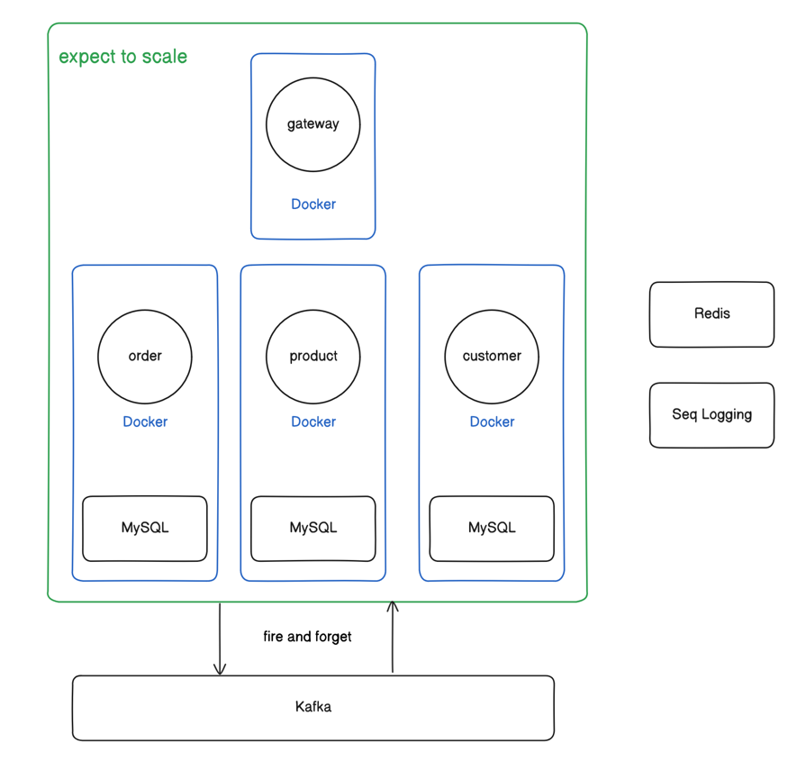

### 인프라 설계도

### 프로젝트 아키텍처 설계 원칙

본 프로젝트의 아키텍처 설계는 높은 수준의 추상화를 가진 모듈이 하위 수준의 모듈에 직접 의존하지 않도록 구성되어 있습니다. 이러한 접근 방식은 인터페이스라는 계층을 도입함으로써 코드 분석의 복잡성을 약간 증가시키는 단점이 있습니다. 그러나, 고객 상품 관리와 같은 마이크로서비스나 토스 페이먼츠 API와 같은 외부 서비스를 연동할 때 인터페이스 기반 설계의 장점은 더욱 분명해집니다.
 
 
실제로, `Infrastructure -> external` 패키지 안에는 `FakePaymentApi.kt`와 같은 테스트용 가짜 객체를 생성할 수 있는 클래스들을 볼 수 있습니다. 이러한 구조는 테스트를 신속하고 단순하게 진행할 수 있게 해 줍니다. 만약 인터페이스 기반 설계를 도입하지 않았다면, 반복적인 실제 API 호출로 인한 시간 소모와 구성의 복잡성에 직면했을 것입니다.

